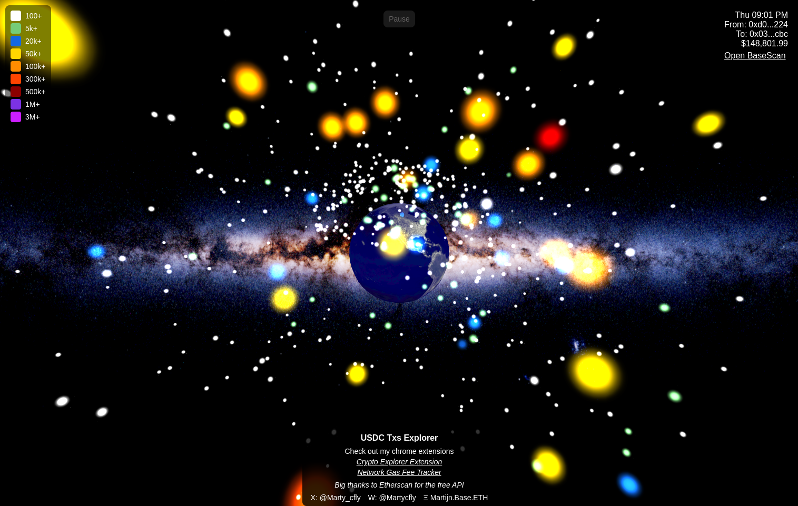

# Cryptoverse Project

Welcome to the Cryptoverse! This project provides a 3D visual representation of blockchain transactions using WebGL,
Three.js, and React Native. Users can explore transactions as stars in space, offering a unique and interactive
experience to visualize on-chain data.

## Website

Explore the Cryptoverse live at [cryptoversemartycfly.vercel.app](https://cryptoversemartycfly.vercel.app/)

## Table of Contents

- [About](#about)
- [Features](#features)

## About

The Cryptoverse app retrieves and visualizes token transactions from blockchain APIs, presenting each as a 3D star
within a virtual galaxy. By selecting or zooming in on stars, users can view transaction details, making it easier to
understand the flow and volume of transactions in real time.

## Features

- **3D Visualization**: Interact with stars representing blockchain transactions in a 3D space.
- **Real-time Data Fetching**: Fetches blockchain transactions on supported tokens (e.g., USDC and HIGHER).
- **Multi-Platform**: Runs on both iOS and Android with Expo and Three.js support.
- **Customizable**: Easily switch tokens or customize transaction star characteristics.
